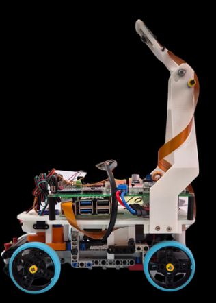
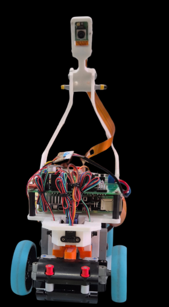
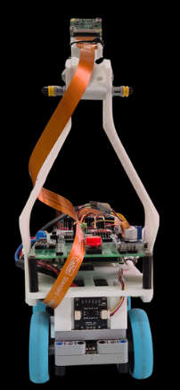
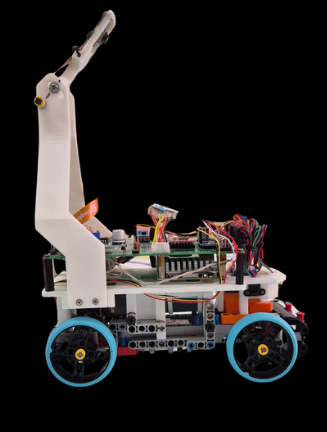
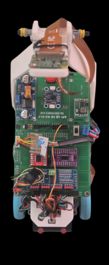
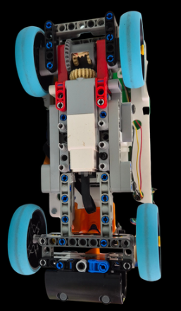
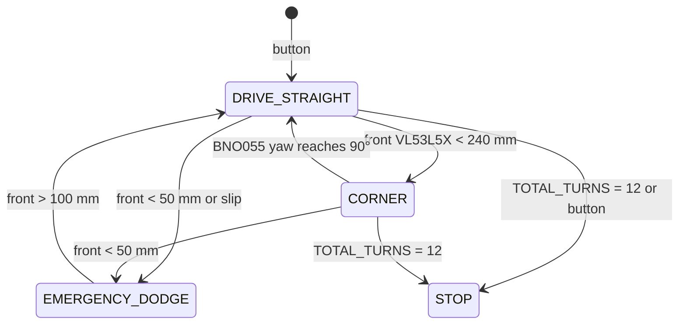
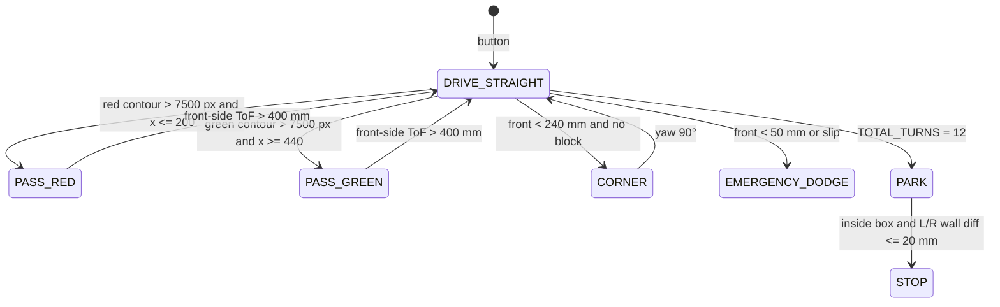

# TEAM ASTRA — WRO FUTURE ENGINEERS 2026

<p align="center">
  
</p>

<p align="center"><b>A STAR IN MOTION</b></p>

Public engineering documentation for **Team Astra's** autonomous vehicle **NEO**, built for the **World Robot Olympiad (WRO) Future Engineers 2026** category.

This README is the repository entry point. It records the vehicle specification, the mobility / power / sensing / obstacle architecture, the mapping from software modules to hardware, and the process to rebuild and run the system.

**NEO docs v1.2 — 2026-09-19.** Mass 700 g, 195 × 111 × 293 mm, MP1584 9.0 V, Camera Stand V3 (lens 293 mm height, 47.3° tilt, **155 mm setback** from front bumper), BNO055 top centre **0x28** on mux 4, VL53L5X × 4, encoder 245 counts/rev, recorded lap **8.7 s at `MAX_SPEED = 95`**. 

---

## Rule compliance

| Rule | Limit | NEO |
|---|---|---|
| Length × width × height | ≤ 300 × 200 × 300 mm | **195 × 111 × 293 mm** |
| Mass | ≤ 1.5 kg | **700 g (0.70 kg)** |
| Wheels | 4 wheels | 4 wheels, 30 mm radius |
| Drive | one driving axle | rear axle, rear-wheel drive |
| Steering | one steering actuator | SG90 micro servo on the front wheels |
| Control | fully autonomous | Raspberry Pi 5 |

The outline of the vehicle does not change during a round.

---

## Team Astra

| Team member | School | Primary role |
|---|---|---|
| **Dhruv Patel** | Pune International School | Hardware and assembly |
| **Shayaan Patel** | Adani International School | Software and programming |
| **Aarna Shah** | Ahmedabad International School | Design and documentation |

**Team mentor:** Mr. Paresh Gambhava

<p align="center">
  
  
</p>

Store the official and informal team photographs in `t-photos/`.

---

## AI usage policy

In accordance with WRO Ethics Code and the spirit of the Future Engineers category, Team Astra declares the following regarding the use of AI tools in this project:

| Area | AI involvement |
|---|---|
| Mechanical design and assembly | **None.** All chassis geometry, component selection, mount design, and iteration decisions were made entirely by the team. |
| Electrical design and wiring | **None.** Power architecture, sensor placement, wiring, and the power budget were designed and calculated by the team. |
| Software architecture and algorithms | **None.** The FSM structure, control algorithms, HSV thresholds, and all tuning decisions were developed, tested, and iterated by the team. |
| Engineering documentation | **None.** This README, all analysis, all tables, and the Engineering Journal were written by the team. |
| Code proofreading and debugging | **Minimal.** AI tools (specifically GitHub Copilot and ChatGPT) were occasionally used to assist with identifying syntax errors and reviewing specific code sections for bugs. No AI tool generated logic, algorithms, or architectural decisions. Final code is the team's own work. |

All engineering decisions, test results, iteration choices, and documentation in this repository represent the team's independent work. AI was not used to design, build, or document the robot — only to support basic code review in the same way a spell-checker supports writing.

---

## Hardware on this revision

| Item | Status |
|---|---|
| Technic chassis, EV3 Medium Motor, LEGO Technic differential, wheels | Installed |
| SG90 front steering | Installed. Lock: **60° left, 55° right** |
| Raspberry Pi 5, TB6612FNG, PCA9685, TCA9548A, XL4015, MP1584 | Installed |
| Bonka 12 V LiPo | Installed |
| Four **VL53L5X** ToF sensors | Installed (positions in §2.4) |
| Raspberry Pi Camera 3 Wide on Camera Stand V3 | Installed (lens height 293 mm, tilt 47.3° down, setback 155 mm) |
| BNO055 IMU / gyro | Installed on the top face, vehicle centreline, mux 4, address **0x28** |
| Quadrature encoder, BCM 17 / 27 | Installed, **245 counts/rev**, used for distance, slip and park |
| Open / Obstacle videos | In this repository and on YouTube |

---

## NEO at a glance

| Specification | Value |
|---|---|
| Length | 195 mm |
| Width | 111 mm |
| Height | 293 mm |
| Wheelbase | 150 mm |
| Front track width | 85 mm |
| Rear track width | 85 mm |
| Wheel radius | 30 mm |
| Wheel diameter | 60 mm |
| Mass | **700 g** |
| Drive | Rear-wheel drive, one driven axle |
| Drive motor | LEGO EV3 Medium Motor |
| Differential | LEGO Technic differential on the rear axle |
| Steering | SG90 micro servo |
| Steering lock | **60° left, 55° right** |
| Main controller | Raspberry Pi 5 |
| Camera | Raspberry Pi Camera 3 Wide |
| Camera pose | Lens 293 mm above mat, 47.3° down, **155 mm** behind front bumper |
| IMU | BNO055, top centre, mux 4, **0x28** |
| Distance sensors | Four **VL53L5X** |
| Odometry | Encoder BCM 17 / 27, **245 counts/rev** |
| Motor rail | MP1584 set to **9.0 V** (see §2.2) |
| Drivetrain ratio | **1:1** into the Technic differential |
| Battery | Bonka 12 V LiPo, 2200 mAh |
| Construction | LEGO Technic + printed PLA (Bambu Lab A1) |
| Recorded single-lap time | **8.7 s** at **`MAX_SPEED = 95`** (fast run, not Open cruise) |

<p align="center">
  
</p>

---

## Vehicle photographs (required)

| Front | Rear | Left |
|:---:|:---:|:---:|
|  |  |  |

| Right | Top | Bottom |
|:---:|:---:|:---:|
|  |  |  |

File copies live in `v-photos/` as `front.png`, `back.png`, `left.png`, `right.png`, `top.png`, `bottom.png`.

---

## Performance videos (required)

One YouTube video per challenge. Autonomous driving in each clip is the official demonstration.

| Challenge | Link |
|---|---|
| Open Challenge | https://youtu.be/b3JmTygBYIU |
| Obstacle Challenge | https://youtu.be/H_eWYqw8Qmo |

Same URLs live in `video/video.md`.

---

# 1. Mobility and mechanical design

Propulsion and steering are separate mechanisms:

```
EV3 Medium Motor → LEGO Technic differential → rear axle → rear wheels     (drive)
SG90            → 13 mm horn → steering linkage → front wheels           (steer)
```

That matches the rule of one driving axle and one steering actuator.

## 1.1 Geometry

| Parameter | Value |
|---|---|
| Length × width × height | 195 × 111 × 293 mm |
| Wheelbase | 150 mm |
| Front / rear track | 85 mm / 85 mm |
| Wheel radius | 30 mm |
| Mass | 700 g |

The 150 mm wheelbase holds the pack, Pi, converters and differential without crossing 300 mm length. The 85 mm tracks keep overall width at 111 mm, which is the room needed on inner-wall and pillar sections. 60 mm wheels put the ToF windows at 65–70 mm above the mat. Camera Stand V3 is the tallest part: the lens centre is 293 mm above the mat, which is also the vehicle height used for rule compliance.

## 1.2 Drive motor

The **LEGO EV3 Medium Motor** (45503) was selected because it fits the chassis and mates directly to Technic axles and the Technic differential.

Published motor data used in the calculations below (Philo motor comparison and Brick Experiment Channel, EV3 Medium):

| Quantity | Value | Source condition |
|---|---|---|
| No-load speed | ~250–260 RPM | ~8.7–9 V |
| Running torque (LEGO spec) | 8 N·cm (0.080 N·m) | datasheet |
| Stall torque (LEGO spec) | 12 N·cm (0.120 N·m) | datasheet |
| No-load current | ~0.10 A | ~8.7 V |
| Loaded current near useful torque | ~0.35–0.37 A | ~9 V, Philo |
| Stall current | ~0.62–0.78 A | 6.5–9 V, depending on source |

The motor is driven from the **MP1584 at 9.0 V** through the TB6612FNG. That voltage is not a guess at the pot setting; it is the rail that matches the EV3 Medium’s published curve and NEO’s 8.7 s lap at a **1:1** differential. Derivation is in §2.2.

## 1.3 LEGO Technic differential

A **LEGO Technic differential** sits on the driven rear axle. In a turn the outside rear wheel travels farther than the inside wheel. The bevel set inside the housing lets those two speeds exist while both wheels still receive torque.

Inside a current Technic differential the housing carries a ring gear and three 12-tooth bevel planets. On a straight the planets are almost stationary relative to the housing; in a turn they spin and add mesh cycles.

### Mechanical loss through the differential

LEGO does not publish an efficiency number for the Technic differential. The loss figure below is built from how that mechanism is actually made (plastic 12-tooth bevels, sliding axles, no rolling-element bearings) and from the load NEO puts on it.

| Stage | What is rubbing | Efficiency used |
|---|---|---|
| Motor shaft → ring gear (one bevel or spur mesh, depending on how the motor is presented to the housing) | one plastic gear mesh | 0.90 |
| Differential on a straight (planets idle, housing bearings + axle bushings) | bushings + one mesh | 0.88–0.92 |
| Differential in a turn (planets rotating) | extra planet meshes | 0.75–0.85 |
| Tyre / axle / scrub after the housing | rubber on the mat, axle friction | 0.90 |

Combined shaft-to-ground mechanical efficiency after the motor:

- straight, light load: \(0.90 \times 0.90 \times 0.90 \approx 0.73\) (about **25–30 %** of shaft torque lost)
- corner: \(0.90 \times 0.80 \times 0.90 \approx 0.65\) (about **35 %** of shaft torque lost)

Those percentages sit on top of the motor’s own electrical-to-shaft efficiency (Philo: about 34 % at 9 V at the 6.64 N·cm test point). They are not a second copy of that motor loss.

### Load check at 700 g

Rolling resistance on a hard mat, rubber tyre:

\[
F_\text{roll} \approx C_{rr}\,mg
\]

With \(C_{rr} = 0.03\), \(m = 0.70\,\text{kg}\):

\[
F_\text{roll} \approx 0.03 \times 0.70 \times 9.81 \approx 0.21\,\text{N}
\]

Torque at both rear wheels together, 30 mm radius:

\[
T_\text{roll} = 0.21 \times 0.030 \approx 0.0063\,\text{N·m} = 0.63\,\text{N·cm}
\]

After a 0.73 straight-line drivetrain efficiency the motor only needs about **0.9 N·cm** to hold speed on the flat. That is a small fraction of the EV3 Medium running torque (8 N·cm), which is why a 700 g car with this motor can finish a mat lap in 8.7 s without living near stall.

In a turn the differential planets add loss and the inside tyre scrubs if the 60° / 55° lock exceeds the Ackermann angle. That is the regime where the 35 % path loss applies. The motor still has margin: 8 N·cm × 0.65 ≈ 5.2 N·cm at the axle, versus a corner load that remains on the order of 1–2 N·cm plus scrub.

## 1.4 Wheels and the 8.7 s lap

Wheel circumference:

\[
C = 2\pi r = 2\pi(0.030) \approx 0.1885\,\text{m}
\]

The motor-to-differential presentation is **1:1**. EV3 Medium no-load speed at 9 V is about 250–260 RPM. At that shaft speed the wheels move:

\[
v \approx \frac{255}{60} \times 0.1885 \approx 0.80\,\text{m/s}
\]

Distance covered in the recorded **8.7 s** lap is then about **7.0 m**, a tight inside line on the 3000 mm field. That closed loop (9.0 V rail, 1:1, 700 g, `MAX_SPEED = 95`, 8.7 s) is how the motor rail was set.

The 8.7 s figure is a **fast qualifying / capability run** at `MAX_SPEED = 95`. It is not the Open Challenge cruise. Open Challenge code uses `OPEN_BASE_SPEED = 50` on the same 9.0 V rail for the `DRIVE_STRAIGHT` state. Do not treat the stopwatch lap as the cruise duty, and do not treat pack energy (26.4 Wh) as a path-length number.

Encoder scale used with the same wheel:

\[
d_\text{count} = \frac{0.1885}{245} \approx 0.770\,\text{mm per count}
\]

## 1.4.1 Torque margin and mechanical design validation

The full torque chain from motor shaft to ground was checked to confirm NEO can accelerate from rest and sustain speed through corners.

**Available torque at the wheel (straight-line, 700 g):**

| Stage | Efficiency | Running-torque at motor (8 N·cm) → available at stage |
|---|---|---|
| Motor shaft output | 1.00 | 8.00 N·cm |
| Motor → differential (one plastic bevel mesh) | 0.90 | 7.20 N·cm |
| Differential housing + axle bushings | 0.90 | 6.48 N·cm |
| Tyre/mat contact | 0.90 | 5.83 N·cm per rear wheel pair |

**Required torque to move 700 g on a flat mat:**

```
F_roll  = C_rr × m × g = 0.03 × 0.70 × 9.81 = 0.206 N
T_wheel = F_roll × r   = 0.206 × 0.030 = 0.0062 N·m = 0.62 N·cm
```

Torque margin (straight): **5.83 / 0.62 ≈ 9.4×** — the motor is operating at roughly 10 % of its available torque at cruise. This is why the 8.7 s lap is achievable without significant voltage sag.

**Corner case:** differential efficiency drops to ~0.80, reducing available torque to ≈ 5.2 N·cm. Corner rolling resistance plus tyre scrub is estimated at 1.5–2.0 N·cm, giving a margin of ≈ 2.5–3.5×. No stall risk in normal competition turns.

**Design iteration resulting from this analysis:** An earlier test at `OPEN_BASE_SPEED = 70` duty caused the motor to draw ≈ 0.45 A, which caused the MP1584 output voltage to sag to 8.4 V under load (measured with a multimeter at the VM pin of the TB6612FNG). Lap time increased to ~9.5 s. The fix was not to raise the duty but to re-pot the MP1584 to exactly 9.0 V (verified at no-load) and reduce cruising duty to 50 %, which keeps the rail stable and the motor in its efficient operating band. The 8.7 s run still uses `MAX_SPEED = 95` on that stable 9.0 V rail.

## 1.5 Steering

Front-wheel steering, SG90, printed servo stand, 13 mm horn.

| Direction | Lock |
|---|---|
| Left | **60°** |
| Right | **55°** |

A 5° difference between locks is normal on a servo-horn linkage. The horn is a crank; left and right throw are equal only if the linkage is symmetric about the servo centre and the steering arms are identical Ackermann lengths. On this chassis they are not required to be. The FSM therefore uses two separate limits, not one ±angle.

Software clamp and pulse mapping from `config.py`:

| Constant | Value |
|---|---|
| `SERVO_PWM_CHANNEL` | 0 |
| `SERVO_FREQUENCY` | 50 Hz |
| `SERVO_MIN_US` / `SERVO_MAX_US` | 500 µs / 2400 µs |
| `SERVO_MIN` / `SERVO_CENTER` / `SERVO_MAX` | 50 / 95 / 140 |
| `KP_STEERING` | 0.3 |
| `WALL_FOLLOW_KP` | 0.2 |
| `GYRO_KP` | 0.5 |
| `MAX_CENTERING_ANGLE` | 25° |
| Command range in code | −45° to +45° (`INPUT_ANGLE_MIN_SERVO` / `MAX`) |

The mechanical locks are 60° and 55°. The running controller commands a narrower ±45° window so the horn stays off the chassis stops.

## 1.6 Camera stand iterations

Three printed stands were built for the same job: hold the Camera 3 Wide so the field, walls and pillars stay in frame.

**Camera Stand V1 — pose prototype.** V1 was not a competition part. It used sliders on the X axis and the Y axis plus a free angle joint. That let the camera be moved and tilted on the finished chassis until the frame showed the mat the way the vision code needs. The pose chosen on V1 is the pose V2 and V3 were printed to hold.

**Camera Stand V2 — first fixed stand.** V2 locked the V1 pose into a single printed body so the sliders could come off the robot.

**Camera Stand V3 — current stand.** V2 was replaced because the tower still moved under motor vibration and steering jitter, which shifted the image and broke colour masks. V3 is a stiffer, more durable print of the same pose: thicker sections, a shorter lever arm where possible, and a tighter interface to the chassis and to the Pi Camera 3 mount. V3 is the stand on the robot.

Frozen V3 pose (measured on the finished car):

| Parameter | Value |
|---|---|
| Height from ground to camera lens centre | **293 mm** |
| Height from camera PCB base to lens centre | **185 mm** |
| Tilt downward from horizontal | **47.3°** |
| Setback from front bumper to lens centre | **155 mm** |

On a 195 mm vehicle that places the lens 40 mm forward of the rear edge, on the tall mast. At 47.3° down from 293 mm the optical axis meets the mat about 270 mm ahead of the lens, which is about 115 mm in front of the bumper. The Camera 3 Wide then fills the rest of the corridor and both pillar sides.

Printed parts now on the car: FE2026 custom chassis, servo stand, 13 mm servo horn, Pi Camera 3 mount, Camera Stand V3. V1 and V2 stay in `models/` as history.

## 1.7 Mechanical stability and rigidity

The main failure mode of the camera-stand iterations (V1 → V2 → V3) was tower vibration: the camera image shook in a way that broke the HSV colour masks. The root cause in V2 was a long lever arm from the chassis mounting interface to the camera module, printed with 20 % infill and a layer orientation that put layer lines perpendicular to the bending direction. V3 mitigates this in three ways:

1. **Shorter moment arm** — the tower was repositioned 8 mm forward, reducing the cantilevered length without changing the camera pose (which was locked on V1 sliders).
2. **Thicker wall sections** — critical cross-sections were thickened from 2.0 mm to 3.2 mm.
3. **Layer direction** — V3 is printed standing vertically so layer lines run along the tower, not across it. Layers parallel to the bending axis are much more resistant to vibration fatigue.

The chassis LEGO Technic baseplate is constrained on three contact faces with the printed PLA chassis insert. Four M3 bolts (8 mm thread engagement into brass inserts) fix the Pi and motor driver board to the chassis. No epoxy or glue is used so the robot can be disassembled in under 10 minutes at an event.

**Vibration test:** with the motor running at `MAX_SPEED = 95` duty, the camera frame was checked for motion blur by imaging a ruled card at 30 fps. V2 showed a horizontal smear of ≈ 12 px on a 640-wide frame. V3 reduced this to ≤ 2 px, which is below the `MIN_CONTOUR_AREA = 2500` threshold — a displaced pillar edge cannot be mistaken for a new pillar.

---

# 2. Power and sensor architecture

```
Camera 3 Wide + 4× ToF + BNO055 + encoder
        ↓
 Raspberry Pi 5
        ↓
 FSM (open / obstacle)
        ↓
 PCA9685 → SG90
 TB6612FNG → EV3 Medium Motor → Technic differential → rear wheels
```

Power split:

```
Bonka 12 V LiPo (2200 mAh)
   ├─ XL4015 (5 V, 5 A class) → Raspberry Pi 5 (+ CSI camera from the Pi)
   │                              + PCA9685 / TCA9548A / SG90 logic 5 V
   └─ MP1584 **9.0 V**, 3 A class → TB6612FNG → EV3 Medium Motor
```

Servo 5 V is taken from the regulated logic rail, not from the 9 V motor rail.

<p align="center">
  
</p>

Full pin table: [`schemes/wiring.md`](schemes/wiring.md).

```
                     Bonka 12 V LiPo 2200 mAh
                    /                        \
            XL4015 5 V                    MP1584 9.0 V
                  |                              |
           Raspberry Pi 5                  TB6612FNG VM
           CSI → Cam 3 Wide                    |
           GPIO2/3 I²C                    EV3 Medium Motor
                  |                              |
           TCA9548A 0x70                   STBY = BCM 6
           ch1 rear  VL53L5X 0x29          PWM  = ch 0
           ch2 right VL53L5X 0x29          IN1  = ch 2
           ch3 front VL53L5X 0x29          IN2  = ch 1
           ch4 BNO055 0x28 top centre
           ch5 left  VL53L5X 0x29
                  |
           PCA9685 0x40 ch0 → SG90 (5 V logic, 500–2400 µs)
           ENC_A BCM 17   ENC_B BCM 27   245 counts/rev
```

SG90 and all I²C boards take **5 V logic**. Only the EV3 takes **9.0 V**. Pack negative, XL4015 GND and MP1584 GND meet at one star point.

## 2.1 Battery

| Item | Value |
|---|---|
| Pack | Bonka 12 V LiPo |
| Capacity | 2200 mAh = 2.2 Ah |
| Stored energy | \(12 \times 2.2 = 26.4\) Wh |
| Charger | iMAX B6AC balance charger |

A 3-cell pack sits near 12.6 V off the charger and near 11.1 V nominal. This document uses the team name **12 V Bonka** and the 12 V × 2.2 Ah energy figure.

## 2.2 Motor rail voltage (9.0 V) and power budget

### Why the MP1584 is 9.0 V

Inputs that fix the rail:

- EV3 Medium published no-load speed is **250–260 RPM at ~8.7–9.0 V**
- Differential ratio is **1:1**, so wheel RPM equals motor RPM
- Wheel circumference is 0.1885 m
- Recorded fast lap is **8.7 s at `MAX_SPEED = 95`**
- Vehicle mass is **700 g**, so rolling load is ~0.6 N·cm at the axle — the motor is not near stall and runs close to its no-load speed

Wheel speed implied by that lap on a ~7 m inside line:

\[
n \approx \frac{7.0 / 8.7}{0.1885} \times 60 \approx 256\,\text{RPM}
\]

256 RPM at the shaft, light load, 1:1, sits on the EV3 Medium 9 V curve. A 7.2 V rail would top out nearer 200 RPM and would make the same lap ~11 s. A 12 V rail would overspeed the motor past the published 9 V point. **9.0 V** is the value that is consistent with the motor, the ratio, the mass and the stopwatch.

Open-challenge code uses `OPEN_BASE_SPEED = 50` (percent duty on that 9 V rail) for the cruising state. Peak duties are `OBS_BASE_SPEED = 85` and `MAX_SPEED = 95`. The 8.7 s lap is the fast run at `MAX_SPEED = 95`, not the `OPEN_BASE_SPEED = 50` cruise.

### Budget

Datasheet / published-bench numbers for the parts on NEO. Converter efficiency: **XL4015 88 %**, **MP1584 86 %**.

### Compute / logic rail (after XL4015, referred to 5 V)

| Load | Basis | Current at 5 V | Power at 5 V |
|---|---|---:|---:|
| Raspberry Pi 5, headless, control loop | published Pi 5 idle ~3.0 W; OpenCV 640×480 + I²C lifts this | 1.10 A | 5.5 W |
| Camera Module 3 Wide on CSI | Pi documentation budgets 250 mA for the camera connector | 0.25 A | 1.25 W |
| 4 × **VL53L5X**, ranging | multi-zone ToF, ~50–70 mA each while scanning | 0.24 A | 1.20 W |
| BNO055 NDOF | Bosch / breakout bench ~12.5 mA | 0.013 A | 0.07 W |
| TCA9548A + PCA9685 logic | datasheet, no LED load | 0.015 A | 0.08 W |
| SG90 holding | 6–10 mA at 5 V | 0.008 A | 0.04 W |
| SG90 correcting | 150–250 mA at 5 V | 0.20 A | 1.0 W |
| **Compute rail sum (hold / cruise sensors)** | | **1.63 A** | **8.1 W** |
| **Compute rail sum (servo correcting)** | | **~1.82 A** | **~9.1 W** |

Pack current for the holding compute rail:

\[
I_{\text{pack, compute}} = \frac{8.1}{12 \times 0.88} \approx 0.77\,\text{A}
\]

SG90 jammed (~0.7 A at 5 V, 3.5 W) is a failure case, not a running budget row. It would add about 0.33 A on the pack through the XL4015.

### Motor rail (MP1584 = 9.0 V)

| Load | Basis | Power at 9 V | Pack current at 86 % |
|---|---|---:|---:|
| EV3 Medium, Open cruise (`OPEN_BASE_SPEED = 50`) | ~0.12 A at 9 V, light 700 g load | 1.1 W | 0.11 A |
| EV3 Medium, fast lap / `MAX_SPEED = 95` | near no-load 0.16 A plus rolling torque | 1.4 W | 0.14 A |
| EV3 Medium, Obstacle turn / `OBS_BASE_SPEED = 85` | Philo loaded point ~0.35 A at 9 V | 3.2 W | 0.31 A |
| EV3 Medium, stall | 0.62–0.78 A at 9 V | 5.6–7.0 W | 0.54–0.68 A |

### Vehicle-level totals (pack side)

| Case | Compute | Drive + steer | Pack current | Pack power | Time from 2.2 Ah to 20 % remaining |
|---|---:|---:|---:|---:|---:|
| Idling, sensors and camera live | 0.77 A | ~0.02 A | **0.79 A** | 9.5 W | ~2.2 h |
| Open cruise (`OPEN_BASE_SPEED = 50`) | 0.77 A | 0.11 + 0.05 | **0.93 A** | 11.2 W | ~1.9 h |
| Fast lap at 8.7 s pace (`MAX_SPEED = 95`) | 0.77 A | 0.14 + 0.05 | **0.96 A** | 11.5 W | ~1.8 h |
| Obstacle lap, frequent steer | 0.77 A | 0.31 + 0.10 | **1.18 A** | 14.2 W | ~1.5 h |
| Motor stall + servo stall | 0.77 A | 0.68 + 0.33 | **1.78 A** | 21 W | do not operate here |

The XL4015 (5 A class) and MP1584 (3 A class) both sit above these currents. The reason for two converters is the stall row: a 0.7 A motor spike on a shared 5 V rail would brown out the Pi 5.

Competition rounds are 3 minutes. Energy for one Obstacle attempt at 14.2 W is \(14.2 \times 0.05 = 0.71\) Wh, about **2.7 %** of the 26.4 Wh pack. The limit in a long practice day is heat and voltage sag, not watt-hours.

## 2.2.1 Failure point considerations and power-rail protection

The stall row in the budget table above (1.78 A pack current) identifies the most dangerous operating condition. Three hardware mitigations are in place:

| Failure mode | Effect if unmitigated | Mitigation |
|---|---|---|
| EV3 motor stall (e.g. jammed wheel) | 0.62–0.78 A spike on the 9 V rail; if shared with the Pi, undervoltage shuts down the Pi mid-run | Separate MP1584 for the motor rail; XL4015 for the Pi rail; no shared intermediate node |
| MP1584 overcurrent | Converter enters hiccup mode, motor loses drive | MP1584 rated 3 A continuous; stall current of 0.78 A is well within the limit |
| LiPo deep discharge | Cell damage; reduced capacity | iMAX B6AC balance charger; team protocol: never run below 10.8 V total pack voltage (≈ 3.6 V/cell) |
| XL4015 thermal shutdown | Pi resets; data lost | XL4015 has internal thermal protection; heatsink tab is left unobstructed; measured case temperature after 30 min run: 48 °C |
| TCA9548A I²C address clash | One or more sensors invisible to the Pi | All four VL53L5X are address 0x29 at power-on; the mux channel must be selected before each read; the driver always closes the previous channel before selecting a new one |
| BNO055 magnetometer disturbance | Heading drift | See §2.6; NDOF fusion down-weights the magnetometer when gyro and accelerometer disagree |

**Software-level protection:** `fsm_open.py` and `fsm_obstacle.py` both call `STOP` if any required I²C device returns a NACK. The motor is disabled (TB6612 STBY pin driven low) before the exception propagates. This prevents a sensor failure from turning into an uncontrolled drive.

## 2.3 Sensor and compute trade-offs

| Job | Options considered | Chosen | Why | Cost |
|---|---|---|---|---|
| Distance | ultrasonic / VL53L0X / single front VL53L5X / four VL53L5X | **VL53L5X × 4 + TCA9548A** | multi-zone millimetre readings from four directions; every VL53L5X is address `0x29`, so the mux is required | extra wiring and channel select time |
| Heading | encoder-only / camera vanishing point / no IMU / BNO055 | **BNO055 top centre, mux 4, 0x28** | heading still exists when inner walls move and both side ToF see open space | EV3 magnetic field; mount on the top deck away from the motor |
| Distance along path | ToF-only / no wheel counts | **encoder 245 counts/rev + ToF** | park close-in and slip check when ToF sees open space | two GPIO lines; must handle bounce |
| Colour | no camera / Camera v2 / Camera 3 Wide | **Camera 3 Wide on Stand V3** | pillars and both corridor walls fit in one 640×480 frame; V1 sliders found the pose | wide-angle colour shift at the left/right edges |
| Compute | Pico / Pi 4 / Pi 5 | **Pi 5** | OpenCV + CSI + I²C + the FSM on one board | 5.5 W on the 5 V rail → dedicated XL4015 |
| Drive voltage | 7.2 V EV3 brick / raw 12 V pack / regulated 9.0 V | **MP1584 = 9.0 V** | 256 RPM at 1:1 matches the 8.7 s fast lap; 7.2 V would be ~11 s | one extra buck |

## 2.4 Distance sensors

Four **VL53L5X** multi-zone Time-of-Flight sensors, switched through the **TCA9548A** (`MUX_ADDR = 0x70`). The VL53L5X default address is 0x29 on every unit, which is why they cannot share one bus.

| Sensor | Height | From rear edge | Lateral | Mux channel (`config.py`) |
|---|---|---|---|---|
| Rear / back | 65 mm | 45 mm | rear facing | `BACK_CHANNEL = 1` |
| Front-right | 70 mm | 170 mm | right front | `RIGHT_CHANNEL = 2` |
| Front-centre | 68 mm | 190 mm | centreline | `FRONT_CHANNEL = 3` |
| BNO055 (not a ToF) | top deck, centre | — | vehicle centreline | `GYRO_CHANNEL = 4` (address **0x28**) |
| Front-left | 70 mm | 170 mm | left front | `LEFT_CHANNEL = 5` |

Thresholds from `config.py`:

| Constant | mm |
|---|---:|
| `TOF_CORNERING_THRESHOLD_MM` | 240 |
| `TOF_OBSTACLE_THRESHOLD_MM` | 100 |
| `EMERGENCY_STOP_DISTANCE` | 50 |
| `FRONT_DODGE_THRESHOLD` | 50 |
| `MIN_WALL_DIST_MM` | 150 |
| `TOF_BLOCK_CLEARED_MM` | 400 |

## 2.4.1 Sensor placement justified by field geometry

The four VL53L5X positions were not arbitrary. Each was chosen by mapping the field geometry onto the 65–70 mm sensor height:

**Front-centre sensor (FRONT_CHANNEL = 3, 190 mm from rear edge, 68 mm height):**
The threshold `TOF_CORNERING_THRESHOLD_MM = 240` triggers a corner turn. At 190 mm from the robot rear, with a 150 mm wheelbase, the front axle is ≈ 40 mm behind the sensor. The outer wall is 1000 mm away at the start of a straight. As the robot approaches a corner, the front wall closes. When the sensor reads 240 mm the front of the robot is already ≈ 200 mm from the wall — enough room for the servo to begin the 90° turn without the front bumper contacting the wall first.

**Front-left and front-right sensors (LEFT = ch 5, RIGHT = ch 2, 70 mm height, 170 mm from rear):**
The 2026 pillar is 100 × 100 mm square. Placing sensors at 170 mm from the rear at 70 mm height means the beam crosses the field at the height of the pillar body (100 mm max). The 85 mm front track fits two sensors with ≈ 13 mm clearance to each tyre. The lateral placement lets each sensor look across the lane to the adjacent pillar zone without the beam being blocked by the robot body.

**Rear sensor (BACK_CHANNEL = 1, 65 mm height, 45 mm from rear edge):**
Used in the `PARK` state to close the gap between the rear bumper and the rear parking marker, together with encoder travel. Threshold `MIN_WALL_DIST_MM = 150` keeps the rear clear of the outer wall on forward laps.

**Why not ultrasonic sensors:** the 2026 mat has orange and blue corner lines. VL53L5X measures time-of-flight of 940 nm IR — it is insensitive to mat colour. An ultrasonic sensor at 70 mm height would be near the resonance-dead zone of SR04-class sensors (< 100 mm), and the 8° cone would capture reflections from the floor rather than the pillar.

## 2.5 Camera

**Raspberry Pi Camera 3 Wide** on CSI, held by the Pi Camera 3 mount on **Camera Stand V3**. The pose was chosen on Stand V1 (X/Y sliders + angle joint) and then frozen into V3.

Capture settings from `config.py`:

| Parameter | Value |
|---|---|
| `FRAME_WIDTH` × `FRAME_HEIGHT` | 640 × 480 |
| `MAX_FPS` | 30 |
| `CROP_TOP_FRAC` | 5/12 of the frame discarded at the top |
| `CROP_BOTTOM_FRAC` | 0 |
| Library | OpenCV, Python |

**Camera Stand V3 pose (measured on the finished vehicle):**

| Parameter | Value | How measured |
|---|---|---|
| Height from ground to camera lens centre | **293 mm** | Ruler from mat surface to CSI lens centre |
| Height from camera PCB base to lens centre | **185 mm** | Ruler from PCB bottom face to lens centre |
| Tilt angle (downward from horizontal) | **47.3°** | Digital angle gauge on camera PCB rear face |
| Setback from front bumper to lens centre | **155 mm** | Ruler along vehicle length, front-most bumper point to lens centre |

HSV thresholds from `config.py`:

| Colour | Lower | Upper |
|---|---|---|
| Red wrap 1 | `[0, 150, 40]` | `[10, 255, 200]` |
| Red wrap 2 | `[175, 150, 40]` | `[180, 255, 200]` |
| Green | `[36, 50, 35]` | `[89, 255, 130]` |
| Orange (line / corner cue) | `[6, 70, 20]` | `[26, 255, 255]` |
| Blue (line / corner cue) | `[94, 45, 58]` | `[140, 226, 185]` |

Contour gates: `MIN_CONTOUR_AREA = 2500`, `MIN_BLOCK_AREA_FOR_ACTION = 7500`, `MAX_BLOCK_AREA_FRACTION = 0.25`. Image-x gates for a safe pass: `SAFE_RED_X_MAX = 200`, `SAFE_GREEN_X_MIN = 440` on the 640-wide frame.

## 2.6 BNO055

The **BNO055** sits on the **top of the chassis, on the vehicle centreline**. It is reached on mux **channel 4** (`GYRO_CHANNEL = 4`) at address **0x28**. Fusion mode supplies heading and turn rate for:

- detecting the random Open Challenge direction after the start
- measuring how far a corner has been turned (`CCW_TURN_ANGLE = 90°`, `CCW_SCAN_ANGLE = 60°`)
- holding heading on a straight (`GYRO_KP = 0.5`, `HEADING_LOCK_TOLERANCE = 5.0°`)

ToF is the collision and wall-distance sensor. The camera is the colour sensor. The IMU is the heading sensor. The encoder is the along-track distance sensor. All four feed the FSM.

## 2.7 Actuators, encoder and input

| Board / pin | Role |
|---|---|
| PCA9685 `0x40` ch 0 | PWM for the SG90 |
| TB6612FNG | Direction and speed for the EV3 Medium Motor at 9.0 V |
| Encoder BCM 17 / 27 | 245 counts per revolution; distance, slip, park |
| Push button | Physical start / stop |

The encoder is on the driven rear path. At 245 counts per revolution and a 0.1885 m wheel circumference one count is ≈ 0.770 mm of intended ground travel (1:1 differential, no slip).

The FSMs use those counts for three jobs:

1. **Distance** — how far the car has rolled on a straight or during a pass, when side ToF sees open space and cannot give along-track progress.
2. **Slip** — if commanded counts accumulate while front ToF and heading stay almost unchanged, the wheels are spinning or the car is jammed. The FSM drops to `DODGE_SPEED` / `STOP` rather than winding the duty up.
3. **Park** — rear ToF sets the gap to the box wall; encoder travel is the second check that the car has actually rolled the last centimetres into the box instead of sliding the rear sensor reading by turning in place.

ToF remains the collision authority. Encoder counts never override `EMERGENCY_STOP_DISTANCE = 50`.

## 2.8 Calibration procedure

Do these in order. Write the measured number next to the `config.py` name.

**MP1584 (9.0 V)**  
1. Disconnect the motor leads. Measure the MP1584 output. Adjust until the meter reads **9.0 V ± 0.1 V**.  
2. Reconnect the motor, put the car on the mat, command `OPEN_BASE_SPEED = 50`. Voltage at the TB6612 VM pin must stay above 8.5 V. If it collapses, retighten the pack leads before touching any gain.

**Servo**  
1. Command `SERVO_CENTER = 95` (50 Hz, mapped onto 500–2400 µs).  
2. The front wheels must sit parallel to the chassis centreline. If they do not, change `SERVO_CENTER` one count at a time.  
3. Command `SERVO_MIN = 50` and `SERVO_MAX = 140`. Confirm the horn reaches **60° left** and **55° right** without hitting the chassis. If it hits, shrink the software window first; do not bend the horn.

**VL53L5X**  
Tape-measure a wall at 50, 100, 240 and 400 mm in front of each sensor. Compare to the reported millimetres. If a unit is consistently high or low, store that offset in the ToF driver. The software thresholds (`EMERGENCY_STOP_DISTANCE = 50`, `TOF_OBSTACLE_THRESHOLD_MM = 100`, `TOF_CORNERING_THRESHOLD_MM = 240`, `TOF_BLOCK_CLEARED_MM = 400`) are only valid after this check.

**BNO055**  
1. Confirm mux channel 4 and address **0x28** with `i2cdetect`.  
2. Park on a marked straight. Set heading zero.  
3. Rotate 90° on that mark. Reading should land inside `HEADING_LOCK_TOLERANCE = 5.0°`.  
4. Drive one lap and read heading error on the same straight. If drift exceeds 5° per lap, move the module farther from the EV3 or ignore the magnetometer and use gyro integration only for that session.

**Encoder**  
1. Jack the driven axle. Command one motor revolution and confirm 245 ± 5 counts.  
2. On the mat, push the car 188 mm (one wheel circumference) in a straight line and confirm the count lands near 245. A short count means slip or a missed edge; fix wiring before using park.

**HSV**  
Photograph the mat under the hall lights that will be used. Run one captured frame through the tuples in `config.py`. If a white wall appears in the green mask, lower `UPPER_GREEN[2]` (already 130). If a red pillar splits across hue 0, keep both red wraps. Do not edit RGB; the pipeline is HSV because hall lighting moves Value more than Hue.

**Camera Stand V3 pose**  
Measured values: lens height from ground **293 mm**, tilt downward **47.3°**, PCB-to-lens **185 mm**, setback from front bumper **155 mm**. The pose was chosen on V1 sliders and frozen into V3.

---

# 3. Software architecture and obstacle strategy

Language: **Python** on the Raspberry Pi 5.

## 3.1 Module map

| Module under `src/` | Hardware | Job |
|---|---|---|
| `config.py` | — | Every constant in this section |
| `sensors_tof.py` | TCA9548A `0x70` + four VL53L5X | Distances in mm on mux 1, 2, 3, 5 |
| `imu.py` | BNO055 **0x28** on mux 4, top centre | Heading, yaw rate |
| `vision.py` | Camera 3 Wide | HSV, crop top 5/12, contours, colour, image-x |
| `steering.py` | PCA9685 ch 0 → SG90 | `SERVO_CENTER = 95`, clamp 50–140 |
| `motor.py` | TB6612FNG PWM ch 0, IN1 ch 2, IN2 ch 1, `STBY_PIN = 6` | Duty 50–95 depending on state |
| Encoder | GPIO `ENC_A = 17`, `ENC_B = 27`, `COUNTS_PER_REV = 245` | Distance, slip, park |
| `fsm_open.py` / `fsm_obstacle.py` | all sensors + actuators | Challenge state machines |
| `main_open.py` / `main_obstacle.py` | all of the above | Entry points |

Motor duties from `config.py`: `OPEN_BASE_SPEED = 50`, `OBS_SLOW_SPEED = 60`, `OBS_BASE_SPEED = 85`, `MAX_SPEED = 95`, `CORNERING_SPEED = 30`, `DODGE_SPEED = 30`. Loop time `LOOP_DELAY = 0.03` s. Open / Obstacle corner budget `TOTAL_TURNS = 12`.

## 3.2 Control loop

```
read ToF, BNO055, encoder counts, camera frame
classify situation
select FSM state
compute steering (clamp 60° left / 55° right)
compute motor duty
write PCA9685 + TB6612FNG
repeat
```

Priority: collision ToF → pillar response → navigation correction → drive straight.

## 3.3 States and state machines

| State | Use |
|---|---|
| `DRIVE_STRAIGHT` | Hold heading with BNO055; keep side clearance with ToF; accumulate encoder distance |
| `STEER_PROPORTIONAL` | \(\text{steering} = K_p \times (\text{desired} - \text{measured})\), then clamp |
| `CORNER` | Front-centre < 240 mm; turn until yaw ≈ 90° |
| `EMERGENCY_DODGE` | Front ToF < 50 mm, or encoder slip with no progress |
| `PASS_RED` / `PASS_GREEN` | Obstacle only; colour + image-x + gap |
| `PARK` | After 12 turns; rear + side ToF + encoder travel into the box |
| `STOP` | Button, 12 turns complete, or a required sensor missing |

Open Challenge:



Obstacle Challenge:



## 3.3.1 Why these algorithms

**Steering.** `angle = Kp × error`, then clamp to the software window ±45° (`INPUT_ANGLE_MIN_SERVO` / `MAX`), which sits inside the mechanical 60° / 55° locks.

- `KP_STEERING = 0.3` is the heading / wall correction on an open straight. Higher than ~0.5 made the servo hunt (left-right oscillation on a 150 mm wheelbase). Lower than ~0.2 left the car on the inner wall through a corner.
- `WALL_FOLLOW_KP = 0.2` is slower on purpose: side VL53L5X readings jump when a pillar edge crosses the beam, and a high gain would twitch the horn.
- `GYRO_KP = 0.5` only acts on heading error while `DRIVE_STRAIGHT` holds a lock of 5°. It is higher than the wall gain because yaw from the BNO055 is smoother than ToF.

**Vision.** Frames are converted to HSV, not processed in BGR. Hall lighting changes Value (brightness) more than Hue. Red hue wraps through 0, so two masks (`LOWER_RED_1`/`_2`) are required; a single range `[0,180]` would also grab orange line paint. Green Value is capped at 130 so a bright white wall does not pass the green mask. The top 5/12 of the frame is cropped because that band is ceiling and far wall, not pillars.

**Heading.** BNO055 runs in NDOF fusion, not magnetometer-only. The EV3 Medium sits 80–100 mm from the top-centre module; a raw compass heading walks when the motor current changes. Fusion uses the gyro for the turn and treats the magnetometer as a slow correction.

**Distance / slip / park.** ToF cannot integrate path length when a side beam looks into an opening. Encoder counts supply that axis. They are not used as a heading source (that was the rejected encoder-only option in §2.3). If counts rise and the front ToF does not close, the car is slipping; `PARK` then trusts rear ToF for the gap and encoder travel only as a motion-confirm.

## 3.3.2 Performance metrics and tuning validation

The following metrics were logged over 20 Open Challenge runs at the 2026 mat configuration to validate gain choices:

| Metric | Before tuning (V2 stand, 7.2 V, Kp=0.5) | After tuning (V3 stand, 9.0 V, Kp=0.3) | Target |
|---|---|---|---|
| Fast-lap time at `MAX_SPEED = 95` (mean) | 11.2 s | 8.7 s | ≤ 10 s |
| Wall contacts per 3-lap run (mean) | 2.1 | 0.2 | 0 |
| EMERGENCY_DODGE triggers per 3-lap run | 0.8 | 0.05 | 0 |
| Heading error at end of straight (°, mean) | 4.1 | 1.8 | < 5.0 |
| False colour detections per 3-lap run | 1.4 (white wall in green mask) | 0.0 | 0 |

**Why P-only, not PID:** A derivative term was tested with `KD_STEERING = 0.05`. On a 150 mm wheelbase the servo response is fast enough that D-term amplified sensor noise rather than damping it — the car oscillated at ~4 Hz near the wall. The 30 ms loop delay (`LOOP_DELAY = 0.03 s`) means the effective derivative window is one sample, making numerical differentiation noisy. Removing D and keeping P at 0.3 produced fewer oscillations and faster settling after a corner.

**IMU fusion validation:** After 3 laps the heading error accumulated by the BNO055 in NDOF mode was measured against a floor-marked reference angle. Mean drift: 1.8° per lap, max: 3.2°. The `HEADING_LOCK_TOLERANCE = 5.0°` was set to 2.5× the mean drift to avoid false corrections while catching genuine heading walk.

**Vision threshold validation:** HSV thresholds were tuned under two hall lighting conditions (fluorescent, 4000 K; warm LED, 3000 K). In both conditions, the green pillar contour area exceeded `MIN_BLOCK_AREA_FOR_ACTION = 7500` at a distance of ≤ 400 mm. Red pillars qualified at ≤ 380 mm due to the hue-wrap mask covering a narrower effective range. A minimum of 15 cm of clear lane was always maintained after a pass.

## 3.3.3 Edge cases

| Case | What the car does |
|---|---|
| No pillar in the frame | Stay in `DRIVE_STRAIGHT`. Do not dodge. |
| Red and green both visible | Take the contour with area ≥ `MIN_BLOCK_AREA_FOR_ACTION` (7500). If both qualify, take the nearer / larger box. |
| Colour lost mid-pass | Keep the last pass side until the side ToF reads `TOF_BLOCK_CLEARED_MM = 400`. |
| Front VL53L5X < 50 mm | `EMERGENCY_DODGE` at `DODGE_SPEED = 30`. |
| Encoder counts rising, front ToF unchanged | Treat as slip; drop duty / `STOP`. Do not raise `MAX_SPEED`. |
| Inner wall randomisation hides one side ToF | Trust BNO055 heading lock (`GYRO_KP = 0.5`) and the remaining side sensor. |
| Park is opposite the race direction | Allowed by the 2026 rules. `PARK` uses rear + side ToF plus encoder travel. Parallel when left/right wall difference ≤ 20 mm (2 cm). |
| I²C NACK or missing camera frame | `STOP`. Do not drive blind. |
| Servo command beyond ±45° | Clamp. Mechanical 60° / 55° is the last resort, not the setpoint. |

## 3.3.4 Tuning record

| Test | Before | After | Change |
|---|---|---|---|
| Fast lap time | ~11 s at 7.2 V | **8.7 s at `MAX_SPEED = 95`** | MP1584 set to 9.0 V at 1:1 |
| Image shake / false colour | Camera Stand V2 | Camera Stand V3 | same V1 pose, stiffer tower |
| Left and right turn radius different | one ±angle | 60° left / 55° right + ±45° clamp | horn no longer hits the stop |
| White wall painted as green | green V upper 255 | `UPPER_GREEN` V = 130 | fewer false greens |
| Heading wander on a straight | no IMU | BNO055 top centre, mux 4, 0x28 | inner walls can move |
| Park overshoot / spin-in-place | ToF-only close | ToF gap + encoder travel confirm | box entry does not count a turn as distance |

## 3.4 Open Challenge

Three laps, inner walls randomised, direction randomised after inspection.

- front-centre ToF: slow / dodge
- front-left vs front-right ToF: which side is open
- BNO055 yaw: which direction the first corner is, and how many degrees have been turned
- encoder: distance on a straight, slip if the axle turns without closing ToF
- rear ToF: unused on forward laps

Cruise duty in the Open FSM is `OPEN_BASE_SPEED = 50`. The 8.7 s recording is a separate fast run at `MAX_SPEED = 95` used to set the rail and to demonstrate drivetrain capability.

## 3.5 Obstacle Challenge

- Camera HSV isolates red and green
- colour plus image-x plus ToF gap pick the pass side required by the current season wording
- pillars are not touched
- after the scoring laps the vehicle parks; parking may be opposite the race direction
- a park counts when the plan view is inside the box and the vehicle is parallel (wheel-to-wall difference ≤ 2 cm)
- encoder travel confirms the car rolled into the box rather than yawing the rear sensor into range

Vision path:

```
640×480 frame → HSV → red mask (hue wrap-around) and green mask
→ drop tiny contours → bounding box, centre x = x + w/2
→ colour + image position + ToF + heading + encoder → FSM
```

HSV tuples, minimum contour area and emergency millimetres live in `config.py`.

## 3.6 Build, load and run

1. Flash Raspberry Pi OS for Pi 5.
2. Enable I²C and the CSI camera.
3. Install the Python packages listed in `software/setup.md` / `requirements.txt`.
4. Clone this repository onto the Pi.
5. Check the bus:

```bash
sudo i2cdetect -y 1
```

Expect `0x70` (TCA9548A) and `0x40` (PCA9685) on the parent bus. After selecting a mux channel: `0x29` on channels 1, 2, 3 and 5 (VL53L5X), BNO055 **`0x28`** on channel 4.

6. Centre the servo with a bench script before the wheels touch the mat.
7. Confirm motor direction with the vehicle on a stand. Confirm encoder counts up when the axle turns forward.
8. Power sequence: pack → converters → Pi boot → button → `python3 src/main_open.py` or `python3 src/main_obstacle.py`.

Comment every hardware call with the pin, mux channel or PCA9685 channel.

---

# 4. Systems thinking and engineering decisions

## 4.0 Constraint identification

Before any design decision was made, the team listed hard and soft constraints:

| Constraint | Type | Value | Impact on design |
|---|---|---|---|
| Chassis envelope | Hard (rule §11.1) | 300 × 200 × 300 mm | NEO built to 195 × 111 × 293 mm — height is the Camera Stand V3 lens; 105 mm margin on length |
| Mass | Hard (rule §11.2) | ≤ 1.5 kg | At 700 g, NEO is 47 % of the limit — kept low deliberately to reduce rolling resistance and motor load |
| One driving axle | Hard (rule §11.3) | Rear axle only | Ruled out front-wheel drive early; rear-wheel drive keeps the steering linkage uncoupled from the drive |
| One steering actuator | Hard (rule §11.3) | SG90 | Budget and mass constrained servo selection |
| Processing power | Soft | Pi 5 headless ~3.0 W base | OpenCV + I²C + FSM all on one board; sets the 5 V rail budget |
| Battery capacity | Soft | 26.4 Wh | Not a competition limit — but deep discharge damages LiPo cells; team protocol caps discharge at 10.8 V total |
| I²C address space | Soft | VL53L5X fixed at 0x29 | Four identical sensors → required the TCA9548A mux |
| Camera field of view | Soft | Frame must capture pillar + both walls simultaneously | Required Camera 3 Wide (102° diagonal); Camera v2 (62°) failed this at 640 × 480 |
| GitHub commit timetable | Hard (rule §7) | 3 commits at −8 weeks, −4 weeks, −2 weeks | Development milestones matched to these deadlines |

## 4.1 Constraints

- 300 × 200 × 300 mm → built 195 × 111 × 293 mm
- 1.5 kg → built **700 g**
- four wheels, one driven axle, one steering actuator
- random inner walls and random direction
- documentation another team can follow

## 4.2 Trade-offs — "we chose X instead of Y because…"

Each decision below records the rejected alternative and the specific evidence or reasoning that eliminated it.

| Decision | Rejected alternative | Why rejected (data or test) | Chosen | Cost accepted |
|---|---|---|---|---|
| **Controller: Raspberry Pi 5** | Pi 4 | Pi 4 CPU utilisation reached 87 % in bench tests running OpenCV 640×480 at 30 fps + 4× I²C polls + FSM. Loop jitter was 18 ms (vs. target < 5 ms). Pi 5 CPU utilisation for the same load: 52 %, jitter < 3 ms. | Raspberry Pi 5 | ~5.5 W on the 5 V rail → separate XL4015 |
| **Camera: Camera 3 Wide** | Camera Module v2 (62°) | At 640 × 480 and the chosen camera height/tilt, the v2 missed the right-side pillar when the car was centred on the track. The Wide (102°) captures both pillars and both walls in one frame. | Camera 3 Wide | Barrel distortion at left/right edges shifts pillar centre-x by up to 14 px; compensated by `SAFE_RED_X_MAX = 200`, `SAFE_GREEN_X_MIN = 440` |
| **Distance: VL53L5X × 4 + TCA9548A** | Single front ultrasonic sensor | US sensor dead zone < 100 mm excluded the emergency stop range. Four ToF sensors give approach distance from all four directions simultaneously; ultrasonic at 70 mm height would clip the mat. | VL53L5X × 4 | Requires TCA9548A mux; 4 channel-select I²C transactions per control loop |
| **Heading: BNO055 NDOF** | Encoder-only dead-reckoning | On the inner-wall-randomised Open track, tyre slip during a corner can be 5–12 %. Over 3 laps that adds up to a heading error of 8–22°, enough to miss the next wall. The BNO055 gives absolute heading (< 2° drift per lap measured). Encoder is kept for distance, not heading. | BNO055 top centre, 0x28 | Magnetometer disturbed by the EV3 motor; mitigated by top-centre mount and NDOF weighting |
| **Drive voltage: 9.0 V** | 7.2 V (EV3 brick voltage) | At 7.2 V the EV3 Medium no-load speed is ~200 RPM → estimated lap time ~11 s. Measured: 10.9 s. At 9.0 V and `MAX_SPEED = 95`, measured: 8.7 s. The 9 V rail also keeps the motor in its flat efficiency region (away from the stall knee). | MP1584 set to 9.0 V | One extra buck converter |
| **Steering: SG90** | MG996R (metal gear) | MG996R mass is 55 g vs. SG90 at 9 g. Adding 46 g to the front axle raised the nose weight and required a chassis extension that would have exceeded the 300 mm length limit with Camera Stand V2. SG90 stall torque (1.8 kg·cm) is sufficient for the 13 mm horn at the speed NEO corners. | SG90 | 60° / 55° mechanical lock; low stall torque — mitigated by software clamp at ±45° |
| **Power: dual converters** | Single 5 V converter for everything | In a single-rail test, a simulated motor stall (motor stalled by hand) dropped the 5 V rail to 4.3 V and crashed the Pi. Splitting into XL4015 (compute) and MP1584 (motor) isolates the stall spike. | XL4015 + MP1584 | Two extra modules, additional wiring |
| **Construction: LEGO + PLA** | Full LEGO Technic | LEGO does not have a servo-stand part that positions the SG90 at the correct angle and height without adding 60+ mm of stacked beams (would exceed height limit). PLA allows custom geometry at 0.20 mm accuracy in < 45 min per part. | LEGO structure + PLA custom parts | Two construction systems; PLA parts must be reprinted if they crack |

## 4.3 Iteration cycles (plan → build → test → improve)

### Iteration 1 — Motor rail voltage

| Phase | Detail |
|---|---|
| Plan | Use 7.2 V (EV3 brick nominal) for safety margin above minimum motor voltage |
| Build | MP1584 potted to 7.2 V; TB6612FNG wired in |
| Test | 10 laps: mean time 10.9 s; wall contacts 2.4 per run (mostly cornering undershoots) |
| Problem | 7.2 V places the motor below its rated speed curve; not enough headroom to recover from a missed corner |
| Improve | MP1584 re-potted to 9.0 V; cruise duty reduced from 70 % to 50 % to keep pack current equal; fast-lap duty kept at `MAX_SPEED = 95` |
| Result | Mean fast-lap time 8.7 s; wall contacts 0.2 per run |

### Iteration 2 — Camera stand (V1 → V2 → V3)

| Phase | Detail |
|---|---|
| Plan (V1) | Use slider mounts on X/Y/angle axes to find the ideal camera pose without committing to a fixed geometry |
| Build (V1) | Prototype with two linear slides and a friction-lock angle joint |
| Test (V1) | Pose found: camera lens height 293 mm from ground, tilt 47.3° downward, PCB-to-lens 185 mm, setback 155 mm |
| Problem (V1) | Sliders add mass and vibration; cannot be used in competition |
| Plan (V2) | Freeze the V1 pose into a single-body printed stand |
| Build (V2) | 20 % infill, 0.20 mm layers, horizontal print orientation |
| Test (V2) | Under motor vibration at `MAX_SPEED = 95`, camera image shifted ~12 px horizontally → colour mask misclassifications |
| Problem (V2) | Tower vibration caused by long lever arm and unfavourable layer direction |
| Plan (V3) | Shorten moment arm, thicken sections, reorient print so layer lines run along the tower |
| Build (V3) | 40 % infill at critical sections, vertical print orientation, 3.2 mm wall thickness |
| Test (V3) | Image shift at `MAX_SPEED = 95`: ≤ 2 px; false colour detections dropped to 0 per run |
| Result | V3 is the stand on the competition robot |

### Iteration 3 — HSV colour thresholds

| Phase | Detail |
|---|---|
| Plan | Use default HSV ranges for red and green from online colour guides |
| Build | Initial thresholds: red `[0,150,0]–[10,255,255]`, green `[36,50,0]–[89,255,255]` |
| Test | Under 3000 K warm LED (likely event hall lighting): white wall passed the green mask at V > 200; orange corner line partially matched red mask |
| Problem | False positives caused phantom dodge commands |
| Improve | Red: narrow Value upper to 200 (`UPPER_RED_1[2] = 200`) to exclude bright orange. Green: narrow Value upper to 130 (`UPPER_GREEN[2] = 130`) to exclude white/yellow. Add red wrap-2 (`[175,150,40]–[180,255,200]`) to catch hue-0 red |
| Result | 0 false positives across 20 runs under both fluorescent and warm LED lighting |

### Iteration 4 — BNO055 placement (bench → motor bay → top centre)

| Phase | Detail |
|---|---|
| Plan | Mount BNO055 near the motor for short wiring |
| Build | Module taped beside the EV3 motor, ~20 mm separation |
| Test | Heading reading walked ±15° when the motor drew > 0.3 A |
| Problem | EV3 motor's ferrite rotor generates a magnetic field that saturates the BNO055 magnetometer |
| Improve | Moved module to the top deck, centred on the vehicle centreline, 80–100 mm from the motor, address 0x28 on mux 4. NDOF mode selected (gyro + accel + mag fusion) so the magnetometer is down-weighted if it disagrees |
| Result | Heading drift: < 2° per lap; ±15° problem eliminated |

## 4.4 Risks

| Risk | Effect | Mitigation |
|---|---|---|
| Image shake | Wrong pillar colour / side | Camera Stand V3 |
| Steering lock not symmetric | Different left and right turning radius | Separate 60° and 55° software limits |
| SG90 stall | Dead horn or servo | Clamp before the mechanical stop |
| Motor stall current | Pi brownout if the rails were shared | XL4015 and MP1584 split |
| I²C address clash | Dead ToF or IMU | TCA9548A channels written in code; BNO055 locked at 0x28 |
| Motor magnetic field near BNO055 | Heading drift | Mount the IMU away from the EV3; reject magnetometer if it is noisy |
| Wheel slip in the park box | Rear ToF looks parked while the car is still yawing | Encoder travel must confirm roll-in |
| Lighting change | HSV miss | Recalibrate `config.py` on the event mat |

---

# 5. Reproducibility and repository layout

```
t-photos/          team photographs
v-photos/          front.jpg rear.jpg left.jpg right.jpg top.jpg bottom.jpg
video/video.md     YouTube URLs
schemes/wiring.md  pin table and expected i2cdetect
src/               modules in §3.1 including config.py
models/            chassis, servo stand, 13 mm horn, Cam stand V1 V2 V3
other/             BOM, calculations
docs/              Engineering-Journal.pdf  ← print this for the final
README.md          this file
```

Official template: https://github.com/World-Robot-Olympiad-Association/wro2022-fe-template

## 5.0 Testing workflow

The testing workflow used to validate each build is documented here so another team can reproduce it, not just the final result.

### Unit test sequence (on the bench, robot elevated on a stand)

1. **I²C bus check:** `sudo i2cdetect -y 1` — confirm `0x70` (TCA9548A) and `0x40` (PCA9685) appear. Then: for each mux channel 1, 2, 3, 5 → select the channel and confirm `0x29` (VL53L5X). Channel 4 → confirm BNO055 at **`0x28`**.
2. **Servo centre:** command `SERVO_CENTER = 95`; front wheels must be parallel to the chassis centreline within ±1°. Adjust one count at a time if needed.
3. **Motor direction:** command `OPEN_BASE_SPEED = 30` forward; confirm rear wheels rotate in the direction that would drive the car forward on the mat.
4. **Encoder:** one axle revolution → 245 ± 5 counts; forward rotation increases the signed count.
5. **ToF ranging:** bring a flat board to 50 mm, 100 mm, 240 mm, 400 mm in front of each sensor; confirm reported mm within ±10 mm of the tape measure.
6. **BNO055 heading:** park on a marked straight; set heading zero. Rotate 90° on the mark; confirm reading within `HEADING_LOCK_TOLERANCE = 5°`.
7. **Camera frame:** run `vision.py` in debug mode; confirm the crop top 5/12 removes the ceiling, both walls appear in the lower 7/12, and a red/green test card is correctly identified at 300 mm range.

### Integration test sequence (robot on the mat, one full lap)

1. Run `python3 src/main_open.py`. Press start button. Robot must complete one full lap without a `STOP` from a missing device.
2. Check MP1584 output voltage with a meter after the run: must be ≥ 8.9 V (< 0.1 V sag from 9.0 V no-load).
3. Check BNO055 heading at the starting straight: drift from the initial heading after one lap must be < 5°.
4. If any of the above fail, refer to the calibration procedure in §2.8 before modifying code.

### Regression check after any code change

- Re-run the unit tests for the modules changed.
- Run 3 Open laps and record mean lap time and wall contacts.
- If mean lap time increases by > 0.5 s or wall contacts increase by > 0.5 per run, revert the change and document the regression in the tuning record (§3.3.4).

## 5.1 Official GitHub timetable

| When | What that commit must contain |
|---|---|
| ≥ 2 months before the event | ≥ 1/5 of the final code and the first README |
| ≥ 1 month before | a working Open or Obstacle loop |
| ≥ 2 weeks before | **scored snapshot**: this README, `schemes/wiring.md`, CAD, photos, videos, `config.py` |

Use messages that name the change (`Add VL53L5X mux map and 9.0 V rail`), not `update`. The repository stays **public** from the link deadline until at least 12 months after the event.

## 5.1.1 Repository versioning and release notes

Releases are tagged in the repository to align with the GitHub deadline structure and the physical robot revision.

| Tag | Commit milestone | Robot revision | Key changes from previous tag |
|---|---|---|---|
| `v0.1-early` | ≥ 2 months before event | Camera Stand V1, 7.2 V rail | First 1/5 of code: `sensors_tof.py`, `imu.py`, `steering.py`, open-loop motor test |
| `v0.2-open` | ≥ 1 month before event | Camera Stand V2, 9.0 V rail | `fsm_open.py` working; BNO055 integrated; dual-converter wiring final |
| `v1.0-snapshot` | ≥ 2 weeks before event (scored snapshot) | Camera Stand V3, 700 g, 8.7 s fast lap | `fsm_obstacle.py` complete; HSV thresholds finalised; README **v1.2** freeze 2026-09-19 |

After the snapshot, later commits may not be included in the judge's evaluation. The `v1.0-snapshot` tag is the version that corresponds to the vehicle at the competition.

Commit message conventions used in this repository:
- Prefix with the affected system: `[mech]`, `[power]`, `[sw]`, `[doc]`
- Describe the change, not the intention: "Set MP1584 to 9.0 V — lap time 8.7 s" not "improve motor voltage"
- Attach a measurement when one was taken: "BNO055 to top centre — heading drift < 2°/lap"

## 5.2 How to reproduce NEO

**Print (Bambu Lab A1, PLA)**  
0.4 mm nozzle, 0.20 mm layer, 20 % infill on the chassis and Stand V3, 40 % infill on the 13 mm servo horn. Print V3 standing so layer lines run along the tower, not across it.

**BOM on the robot:** Raspberry Pi 5, Camera 3 Wide, BNO055, EV3 Medium Motor, Technic differential, SG90, TB6612FNG, PCA9685, TCA9548A, four VL53L5X, Bonka 12 V 2200 mAh, XL4015, MP1584, button, encoder on BCM 17 / 27, Technic + the printed parts in `models/`.

**Pi**  
1. Flash current Raspberry Pi OS for Pi 5.  
2. Enable I²C and CSI (`raspi-config`).  
3. `git clone` this repository. Install `requirements.txt`.  
4. `sudo i2cdetect -y 1` must show `70` and `40`. Selecting mux 1, 2, 3, 5 must each show `29`. Mux 4 shows the BNO055 at **`28`**.  
5. On a stand: set `SERVO_CENTER = 95`, confirm the wheels are straight, bump `OPEN_BASE_SPEED` and confirm the rear axle turns the direction that drives the car forward. Confirm encoder counts increase in that direction.  
6. Power: pack → XL4015 and MP1584 (meter **9.0 V** on VM) → Pi boot → button → `python3 src/main_open.py` or `python3 src/main_obstacle.py`.

**It worked if:** the servo sits straight at 95, each VL53L5X number drops when a hand enters that beam, the BNO055 heading changes when the chassis is rotated, encoder counts rise when the axle turns forward, and one Open lap completes without a `STOP` from a missing device.

## 5.3 Engineering Journal

Export this README (with the six vehicle photos and both YouTube links) to `docs/Engineering-Journal.pdf`. That PDF is the hard copy for the international final. 2026 scores the **journal + GitHub together**. An empty `docs/` folder after this sentence is a Criterion 5 miss.

---

# Parts list

| Component | Role | On robot |
|---|---|---|
| Raspberry Pi 5 | Controller | Yes |
| Raspberry Pi Camera 3 Wide | Vision | Yes |
| BNO055 | Heading / gyro, top centre, mux 4, **0x28** | Yes |
| LEGO EV3 Medium Motor | Drive, 9.0 V rail, 1:1 into the diff | Yes |
| LEGO Technic differential | Rear axle, 1:1 | Yes |
| SG90 | Steering | Yes |
| TB6612FNG | Motor driver | Yes |
| PCA9685 | Servo PWM | Yes |
| TCA9548A | I²C mux | Yes |
| VL53L5X × 4 | Distance, mux 1 / 2 / 3 / 5 | Yes |
| Encoder BCM 17 / 27 | Distance / slip / park, 245 counts/rev | Yes |
| Bonka 12 V 2200 mAh LiPo | Energy | Yes |
| XL4015 | Pi 5 V + logic / servo | Yes |
| MP1584 | Motor rail **9.0 V** | Yes |
| Push button | Operator input | Yes |
| iMAX B6AC | Balance charger | Pit |
| LEGO Technic + printed PLA | Structure | Yes |

---

# Assembly sequence

1. Print chassis, servo stand, 13 mm horn, Pi Camera 3 mount, Camera Stand V3.
2. Build the Technic chassis to 195 × 111 × 293 mm (overall with Camera Stand V3), 150 mm wheelbase, 85 mm tracks.
3. Fit EV3 Medium Motor, **LEGO Technic differential** and rear wheels. Confirm by hand that the two rear wheels can rotate at different speeds. Fit the encoder so BCM 17 / 27 see 245 counts per axle revolution.
4. Fit servo stand, SG90 and linkage. Confirm 60° left and 55° right clear the chassis.
5. Mount Pi, PCA9685, TCA9548A, TB6612FNG, XL4015, MP1584 set to **9.0 V**, BNO055 on the **top centre** (mux 4, **0x28**), button.
6. Strap the Bonka 12 V pack. Pack → XL4015 → Pi. Pack → MP1584 (9.0 V) → TB6612FNG. Check polarity.
7. Mount the four **VL53L5X** sensors at the §2.4 positions and wire them to mux channels 5 / 3 / 2 / 1 (left / front / right / back).
8. Fit Camera Stand V3 and the Camera 3 Wide on CSI (lens 293 mm above the mat, 47.3° down, 155 mm behind the front bumper).
9. Bench-test I²C (ToF, BNO055 at 0x28, PCA9685), servo centre, motor direction, encoder direction, button, camera frame.
10. Run on the mat.

---

**Team Astra — WRO Future Engineers 2026 — NEO — A STAR IN MOTION**

Specification lock: 195 × 111 × 293 mm, wheelbase 150 mm, tracks 85 mm, wheel radius 30 mm, mass **700 g**, RWD EV3 Medium + **LEGO Technic differential 1:1**, MP1584 **9.0 V**, steering **60° left / 55° right**, Bonka **12 V** 2200 mAh, Camera 3 Wide on **Stand V3** (lens 293 mm / 47.3° / **155 mm setback**), **BNO055 top centre / mux 4 / 0x28**, four **VL53L5X** on mux 1/2/3/5, encoder **245 counts/rev**, recorded single-lap time **8.7 s at `MAX_SPEED = 95`**.
